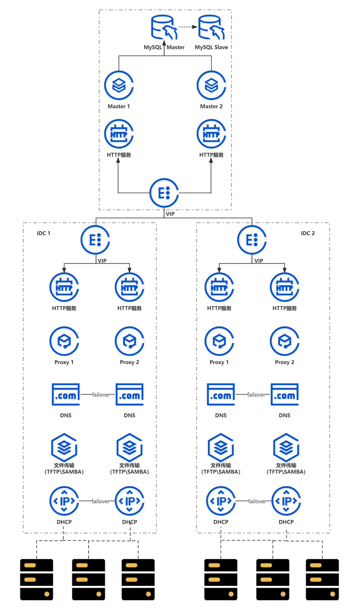

# CyclOne

#### 介绍
One-stop resource full-cycle management platform.
一站式资源全周期管控平台：基于开源组件进行二次研发，围绕数据中心、机柜、网络以及裸机资源池、硬件巡检、自动部署、带外管理等主要功能模块，结合全生命周期闭环管理理念设计运营流程进行构建，实现部署架构灵活可靠+资源架构兼容可扩的"双可"平台。

#### 软件架构
软件架构


#### 安装教程
0. 环境
- 操作系统版本: openEuler release 20.03 (LTS-SP3)
- 容器部署: systemd-nspawn

1. 下载安装包

- https://gitee.com/src-openeuler/CyclOne

2. 容器部署
- 解压 cyclone.tar

```plain
umask 022
mkdir -p /data/cyclone
tar --numeric-owner -xpf cyclone.tar -C /data/cyclone
```

- 创建 systemd-nspawn 服务

```plain
cat > /lib/systemd/system/systemd-nspawn@.service <<'EOF'
[Unit]
Description=Container %I
Documentation=man:systemd-nspawn(1)
PartOf=machines.target
Before=machines.target

[Service]
ExecStart=/usr/bin/systemd-nspawn --quiet --keep-unit --boot --link-journal=try-guest --machine=%I -D /data/%I
KillMode=mixed
Type=notify
RestartForceExitStatus=133
SuccessExitStatus=133
Slice=machine.slice
Delegate=yes

[Install]
WantedBy=machines.target
EOF
```


- 启动 cyclone 容器

```plain
systemctl stop firewalld
setenforce 0
systemctl enable systemd-nspawn@cyclone
systemctl start systemd-nspawn@cyclone


```

#### 使用说明

1.访问项目：http://127.0.0.1

#### 参与贡献

1.  Fork 本仓库
2.  新建 Feat_xxx 分支
3.  提交代码
4.  新建 Pull Request


#### 特技

1.  使用 Readme\_XXX.md 来支持不同的语言，例如 Readme\_en.md, Readme\_zh.md
2.  Gitee 官方博客 [blog.gitee.com](https://blog.gitee.com)
3.  你可以 [https://gitee.com/explore](https://gitee.com/explore) 这个地址来了解 Gitee 上的优秀开源项目
4.  [GVP](https://gitee.com/gvp) 全称是 Gitee 最有价值开源项目，是综合评定出的优秀开源项目
5.  Gitee 官方提供的使用手册 [https://gitee.com/help](https://gitee.com/help)
6.  Gitee 封面人物是一档用来展示 Gitee 会员风采的栏目 [https://gitee.com/gitee-stars/](https://gitee.com/gitee-stars/)
